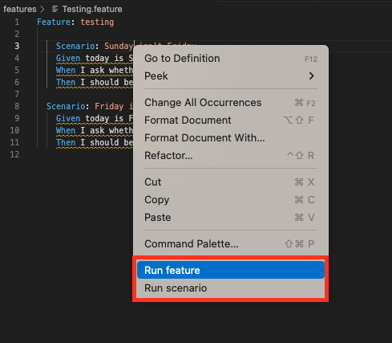
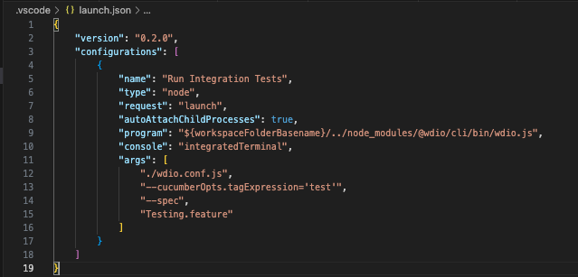

# CDM Test Runner README
You have the option to execute your tests directly from the feature file by performing a right mouse click. This gives you two choices:

- "Run feature": This allows you to run all the scenarios present in the current feature file.

- "Run scenario": This enables you to run the scenario where your cursor is positioned.

As shown in the following picture:

To facilitate test execution, the extension utilizes the launch.json file. This file contains various parameters that you can specify to configure your test runs. When you select the right mouse click option, the extension automatically updates the feature file to be executed with the one corresponding to your selection.

## Prerequisites:
To proceed, please ensure that your Visual Studio Code (VSCode) is updated to at least version "1.79.2".
