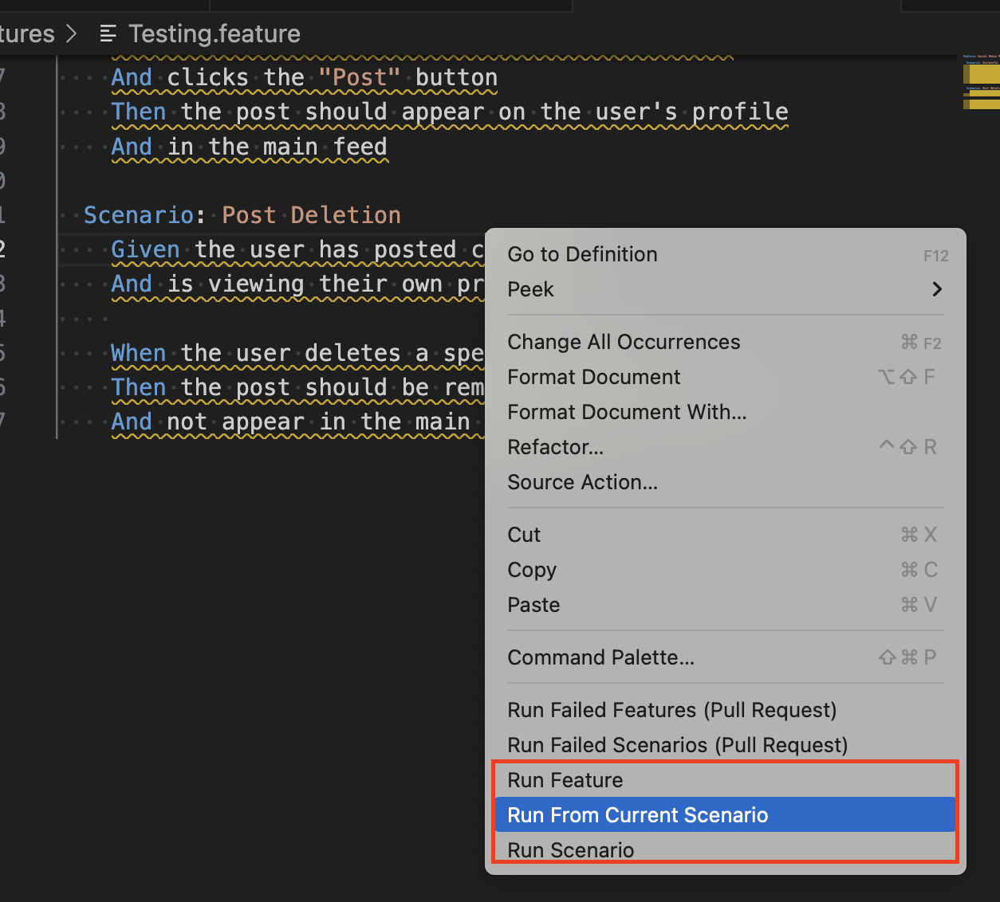
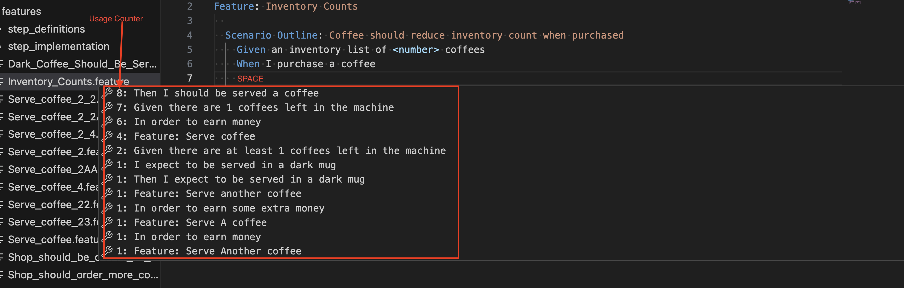

# Why you need CDMtestRunner:
This is extension comes with a very usefull functionalities that can save your time in executing gherking scenarios or searching the steps.
- This extension allows you to execute the features files or a specific scenario, directely from the feature file without the need to change your launch.json file.
-In addition, it gives you the possibility to search the steps inside the scenario that you are writing, you need to types some key words, and by typing "SPACE" afterwards, it will find all the steps that are maching the typed key words, the list of prposed steps are ordered according to the number of words that are maching your searching key words.
- On the top of that, if you are in new line to write a new step and you want find the suitable step, you have only to type space, this will scan all existing steps, and it will collect the statistics about the next step that are the most used, and it will propose them o you in descending order of the steps that are mostely used.

# Execute tests from feature files:
You have the option to execute your tests directly from the feature file by performing a right mouse click:

- "Run Feature": Run the complete feature file which you have opened or have the cursor on, you can also run from the feature files tree folders.

- "Run From Current Scenario": Run from the feature file where you position the cursor until the end of feature file.

- "Run Scenario": Run the scenario by right mouse menu, you need to position the mouse at the title of scenario.

As shown in the following picture:

# Search steps and steps suggestions:
You can search the step with the need to leave your feature file, all you need is:
- In new line,  you type the keyboard key 'SPACE', it will prpose you a list of steps ordered descendingly according to their usage after the previous step.

- In the line of the step you enter some keywords of step you are looking for, like 'click button', and you type 'SAPCE', it will search all the steps that contains the key words you typed first, and prpose you a list of steps ordered by theirs usages.

## Prerequisites:
To proceed, please ensure that your Visual Studio Code (VSCode) is updated to at least version "1.79.2".