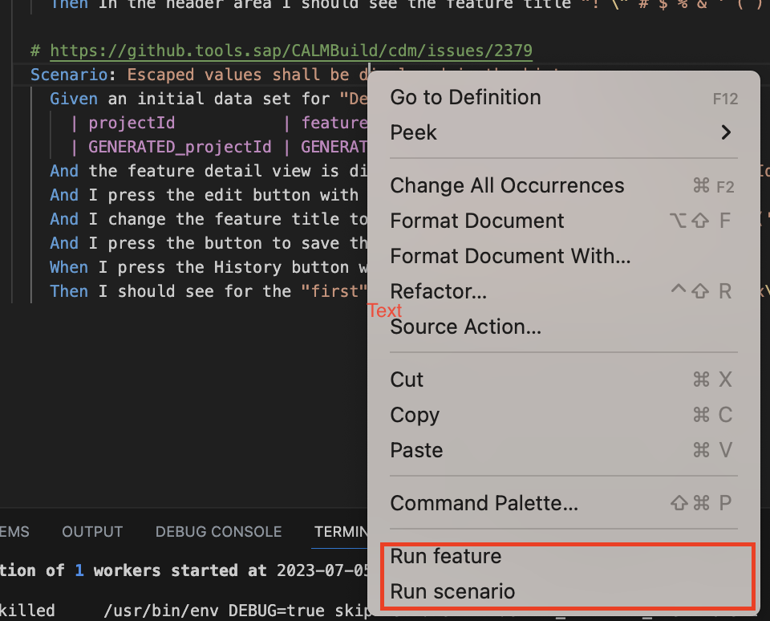

# CDM Test Runner README
You can run your tests from feature file, by right mouse click:
- Run feature: run the whole scenarios inside the current feature file.
- Run scenario: run the scenario where you have curso on.

As shown in the following picture:

The extension will parse the launch.json where you have specified the different parameters to run your tests, it will replace the feature file to be run with the one where you have clicked the right mouse click menue.

